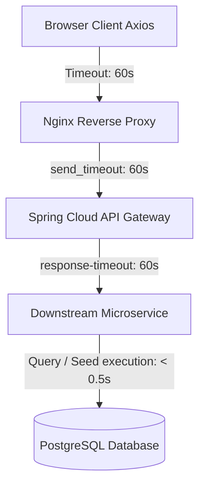

# TradeX — API Limitations & Architecture Constraints

> **Document Scope:** Comprehensive reference for system constraints, data limits, window clamping rules, timeouts, and trading limitations across the TradeX backend microservices and API gateway.

---

## Table of Contents
1. [Overview & Simulation Architecture](#1-overview--simulation-architecture)
2. [Market History: Interval & Range Data Limits](#2-market-history-interval--range-data-limits)
   - [Why High-Frequency Intraday Data Must Be Clamped](#why-high-frequency-intraday-data-must-be-clamped)
   - [Per-Interval Clamping & Resolution Matrix](#per-interval-clamping--resolution-matrix)
   - [Upfront Boundary Clamping vs. Post-Query Truncation](#upfront-boundary-clamping-vs-post-query-truncation)
3. [Network, Gateway & Client Timeouts](#3-network-gateway--client-timeouts)
   - [Timeout Cascade Hierarchy](#timeout-cascade-hierarchy)
   - [JSON Payload & Memory Limits](#json-payload--memory-limits)
4. [Live Price Generation & Reseeding Constraints](#4-live-price-generation--reseeding-constraints)
   - [Second Candle Generation](#second-candle-generation)
   - [Gap & Divergence Thresholds](#gap--divergence-thresholds)
   - [Rate-Limiting Price Delta](#rate-limiting-price-delta)
5. [Trading & Portfolio Engine Limitations](#5-trading--portfolio-engine-limitations)
   - [Order Execution Constraints](#order-execution-constraints)
   - [Portfolio Valuation & P/L Constraints](#portfolio-valuation--pl-constraints)
   - [Pagination & Query Filtering Gaps](#pagination--query-filtering-gaps)
6. [Notification & User Service Limitations](#6-notification--user-service-limitations)
7. [Client Guidelines & Best Practices](#7-client-guidelines--best-practices)

---

## 1. Overview & Simulation Architecture

TradeX is an offline, self-contained paper trading platform that does not connect to external market data vendors (e.g. NSE, Bloomberg, Yahoo Finance). Instead, it uses a deterministic synthetic data generator and a real-time stochastic simulator.

Because all historical candles and live ticks are simulated and stored in PostgreSQL (`market_price_candles_history`), unbounded client requests can create severe computational, database, and network bottlenecks if left unconstrained.

---

## 2. Market History: Interval & Range Data Limits

### Why High-Frequency Intraday Data Must Be Clamped

In real-world charting systems (e.g., TradingView, Bloomberg Terminal, Binance), high-resolution tick or second data is **strictly intraday**:
- **1-Second Resolution (`SECONDS` / `1s`):**
  - In 1 hour: $3,600$ candles ($\approx 540\text{ KB}$ JSON).
  - In 1 day (24h): $86,400$ candles ($\approx 13.8\text{ MB}$ raw JSON). Generating $86,400$ candles requires 87 JDBC batch inserts, taking 15–25 seconds.
  - In 5 days: $432,000$ candles ($\approx 69\text{ MB}$ raw JSON).
  - In 5 years: $157,680,000$ candles. Generating or querying 157 million candles will crash the JVM with an `OutOfMemoryError` or lock PostgreSQL indefinitely.
- **1-Minute Resolution (`MINUTE` / `1m`):**
  - In 1 day: $1,440$ candles ($\approx 216\text{ KB}$ JSON).
  - In 3.5 days: $5,000$ candles ($\approx 750\text{ KB}$ JSON).
  - In 1 month: $43,200$ candles ($\approx 6.5\text{ MB}$ JSON).
  - In 5 years: $2,628,000$ candles.

Rendering more than 3,000–5,000 candles on an HTML5 Canvas using TradingView Lightweight Charts causes noticeable frame drops, high browser memory consumption, and canvas sluggishness.

### Per-Interval Clamping & Resolution Matrix

The backend enforces strict window clamping on all queries to `/api/market/history/{symbol}`, regardless of whether parameters are specified via preset `range`, custom `from`/`to`, or default settings:

| Interval Code | Database Interval | Maximum Allowed Candles | Maximum Time Span | Default Preset Window | Rationale |
| :--- | :--- | :--- | :--- | :--- | :--- |
| `1s`, `SECONDS` | `SECONDS` | **3,600** candles | **1 Hour** | `1D` (clamped to latest 1h) | Prevents runaway loop generation; limits payload to $<600\text{ KB}$; response time $<300\text{ms}$. |
| `1m`, `MINUTE` | `MINUTE` | **5,000** candles | **$\approx$ 3.5 Days** (5,000 min) | `1D` (1,440 candles) or `5D` (clamped to 3.5d) | Intraday high resolution; guarantees sub-second seeding and querying. |
| `1h`, `HOURLY` | `HOURLY` | **5,000** candles | **$\approx$ 208 Days** (7 months) | `1M` (720 candles) or `3M` | Medium-term intraday; balances granular detail with performance. |
| `D`, `1D`, `DAILY` | `DAILY` | **5,000** candles | **$\approx$ 13.7 Years** (5,000 days) | `1Y` (365 candles), `5Y` (1,825 candles), `ALL` (3,652 candles) | **Full 10-year history is 100% preserved.** Seeding takes $<400\text{ms}$, query takes $<20\text{ms}$. |
| `W`, `1W`, `WEEKLY` | `WEEKLY` | **10,000** candles | **$\approx$ 190 Years** | `5Y` (260 candles), `ALL` (520 candles) | Full history preserved without any truncation. |
| `M`, `1M`, `MONTHLY` | `MONTHLY` | **10,000** candles | **$\approx$ 833 Years** | `ALL` (120 candles) | Full history preserved without any truncation. |

> [!IMPORTANT]
> **Case Sensitivity for TradingView Codes:**
> - `1m` or `m` (lowercase) = `MINUTE`
> - `1M` or `M` (uppercase) = `MONTHLY`
> The parser distinguishes between these two standard TradingView codes explicitly.

### Upfront Boundary Clamping vs. Post-Query Truncation

Prior implementations queried the unconstrained date range from PostgreSQL, instantiated tens of thousands of Hibernate entities, and then sliced the list (`candles.subList(...)`) in memory. If data was missing, the seeder attempted to generate hundreds of thousands of candles.

**Current Architectural Enforcement:**
1. In `MarketHistoryService.history()`:
   ```java
   long maxAllowedCandles = switch (targetInterval) {
       case SECONDS -> 3600L;
       case MINUTE, HOURLY, DAILY -> 5000L;
       case WEEKLY, MONTHLY -> 10000L;
   };
   LocalDateTime earliestAllowed = ...; // endTime minus maxAllowedCandles
   if (startTime.isBefore(earliestAllowed)) {
       startTime = targetInterval.normalizeStart(earliestAllowed);
   }
   ```
2. In `HistoricalMarketDataSeeder.seedMissingHistory()`:
   The same `earliestAllowed` boundary is checked before generating candles. A `remainingSteps >= 0` loop guard guarantees that the candle generation while-loop cannot run more than the safe maximum iterations.
3. In SQL execution:
   `marketPriceHistoryRepository.findBySymbolAndIntervalAndCandleTimeBetweenOrderByCandleTimeAsc(...)` utilizes the composite index `(symbol, candle_interval, candle_time)` to perform an index range scan solely within the bounded window, returning at most 5,000 rows.

---

## 3. Network, Gateway & Client Timeouts

### Timeout Cascade Hierarchy

To avoid premature request cancellations (`ECONNABORTED`), the timeout cascade is configured with healthy margins:



| Layer | Configuration Location | Setting | Value | Previous Value (Cause of Issue) |
| :--- | :--- | :--- | :--- | :--- |
| **Browser (Axios Client)** | `trade-x-ui/src/api/client.ts` | `const TIMEOUT` | **60,000 ms** (60s) | `15_000 ms` (15s) — **Cancelled requests at 15s** |
| **Market API Function** | `trade-x-ui/src/api/market.api.ts` | `timeout` option | **60,000 ms** (60s) | Inherited default |
| **API Gateway HTTP Client** | `api-gateway.yml`, `api-gateway-prod.yml` | `response-timeout` | **60s** | `10s` — **Timed out backend calls at 10s** |
| **API Gateway Connect** | `api-gateway.yml`, `api-gateway-prod.yml` | `connect-timeout` | **5000 ms** | `3000 ms` |
| **Nginx Reverse Proxy** | `nginx/conf/nginx.conf` | `send_timeout`, `keepalive_timeout` | **60s**, **65s** | 60s |
| **Database Execution Time** | `market-service` | Query execution | **$< 350\text{ms}$** | $> 25\text{s}$ prior to window clamping |

### JSON Payload & Memory Limits

- **Maximum Candles Returned:** Hard capped at **5,000** items.
- **Maximum JSON Response Size:** $\approx 750\text{ KB}$ uncompressed ($\approx 70\text{ KB}$ with Nginx Gzip compression).
- **Jackson Serialization:** Completed in $< 10\text{ms}$ for 5,000 candles.
- **Client Parsing & Rendering:** Completed in $< 15\text{ms}$ in modern V8 / browser engines.

---

## 4. Live Price Generation & Reseeding Constraints

### Second Candle Generation
- When `tradex.market.history.interval=SECONDS`, `HistoricalMarketDataSeeder.generateOngoingCandle()` runs on a fixed delay of **1,000 ms** (1 second).
- It generates the next second candle using the live price from `LivePriceService` and the previous candle's close.

### Gap & Divergence Thresholds
- **5% Gap Threshold:** If the live price and the latest candle close diverge by more than **5%**, the seeder considers the history out of sync and automatically reseeds the last 1 hour of `SECONDS` history to ensure realistic chart continuity.
- **Startup Divergence Check:** If the oldest or latest candle differs significantly from the target reference price on startup, existing partial history is purged and regenerated to eliminate artificial price jumps.

### Rate-Limiting Price Delta
- To prevent jagged spikes in 1-second charts, the maximum simulated price movement per second is capped at **0.25%** of the previous close:
  $$\Delta_{\max} = P_{\text{prev}} \times 0.0025$$
- If the live target price is further away, the candle close moves towards it in incremental steps of $0.25\%$ per second, creating smooth, realistic price transitions.

---

## 5. Trading & Portfolio Engine Limitations

### Order Execution Constraints
- **Market Orders Only:** The platform supports only immediate market orders (`BUY` and `SELL`). There is no support for limit orders, stop-loss orders, bracket orders, or after-market orders (AMO).
- **Instant Execution:** All orders execute immediately at the stock's current `referencePrice` (status `EXECUTED`). There is no pending or unfilled order state.
- **Cash & Margin:** No margin or leverage trading is supported. Purchases require $100\%$ available cash in the user's virtual balance (initial balance ₹10,00,000). Short selling without existing holdings is rejected with `400 Bad Request`.
- **Fractional Shares:** Quantities support up to 4 decimal places (`0.0001` minimum).

### Portfolio Valuation & P/L Constraints
- **Unrealized P/L Only:** Portfolio valuation calculates unrealized P/L based on `(lastPrice - averagePrice) * quantity`.
- **No Daily ("Today's") P/L:** The backend calculates total unrealized P/L from cost basis, but does not track day-start net asset value (NAV) for daily P/L calculations.

### Pagination & Query Filtering Gaps
- **Orders History (`GET /api/orders/history`):** Returns all executed orders sorted by `createdAt DESC`. Does not support Spring `Pageable`, date range filtering, or side filtering.
- **Transactions History (`GET /api/transactions`):** Returns all ledger transactions. Does not support server-side pagination.

---

## 6. Notification & User Service Limitations

- **No Read/Unread State:** The `UserNotification` entity stores notifications generated by price alerts. It does not track a `read` boolean flag or provide a `PATCH` endpoint to mark notifications as read.
- **Notification Retention:** Notifications are ordered by creation date; aggregation endpoints (`/api/dashboard`) limit results to the latest 10 notifications.
- **No Profile Avatar:** User accounts do not support profile picture uploads or avatar URLs; avatars are rendered using initials generated from `fullName`.

---

## 7. Client Guidelines & Best Practices

1. **Match Interval to Range:**
   When allowing users to switch intervals or ranges, follow standard charting presets:
   - For `1s`: Always pair with `1D` (displays latest 1 hour).
   - For `1m`: Pair with `1D` or `5D`.
   - For `1h`: Pair with `1M` or `3M`.
   - For `D`: Pair with `1M`, `6M`, `1Y`, `5Y`, or `All`.
2. **Handle Clamped Start Dates Gracefully:**
   If a user selects a wide date span (e.g. 5 years) on a 1-second interval, the API will return the most recent 3,600 seconds. The chart time scale should call `fitContent()` to frame the returned window.
3. **Use Zero-Flicker State Caching:**
   Configure TanStack Query with `placeholderData: (previousData) => previousData` so existing candles remain visible while new intervals load.
4. **Subscribe to Real-Time Topics Sparingly:**
   Subscribe to `/topic/{symbol}` when viewing a single stock detail page, and `/topic/market` on global market overview pages. Unsubscribe on component unmount to prevent unnecessary WebSocket frame processing.

