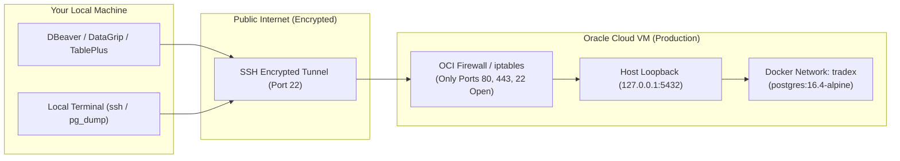

# TradeX Production Database Management & Backup Guide

This guide details the **most secure and reliable operational practices** for inspecting, modifying, and backing up the PostgreSQL production database in TradeX.

---

## 1. Security Architecture Overview

### The Security Golden Rule
> **NEVER expose PostgreSQL port 5432 to the public internet (`0.0.0.0:5432`).**  
> Automated bots scan port 5432 globally 24/7 attempting credential stuffing, dictionary attacks, and exploiting unpatched zero-days.

### Why SSH Tunneling is the Best Approach
Instead of exposing PostgreSQL or hosting a resource-heavy, attack-prone web GUI (like pgAdmin or Adminer) on the public web:
1. **Dual-Layer Defense (MFA / Cryptographic)**:
   - **Layer 1 (Network)**: Access requires your SSH private key (`OCI_SSH_KEY`) authorized on the server. The public internet cannot even detect port 5432 is running.
   - **Layer 2 (Database)**: Access requires PostgreSQL role authentication (`POSTGRES_USER` / `POSTGRES_PASSWORD`).
2. **Zero Server Overhead**: Local desktop GUIs (DBeaver, DataGrip, TablePlus) run on your machine, using 0 MB of RAM on your cloud VM.
3. **End-to-End Encrypted**: All queries, table data, and credentials travel over an encrypted SSH tunnel (AES-256 / ChaCha20-Poly1305).
4. **Loopback-Only Binding**: In `docker-compose-prod.yml`, the database port is bound strictly to `127.0.0.1:5432:5432`, making it reachable **only** via localhost / SSH tunnels.



---

## 2. Viewing & Modifying Data: Connecting with Local GUI

Modern database clients (DBeaver, DataGrip, TablePlus, Beekeeper Studio) have **native SSH tunnel support built-in**.

### Method A: DBeaver (Community / Pro)
1. Open DBeaver $\rightarrow$ Click **New Database Connection** $\rightarrow$ Select **PostgreSQL**.
2. **Main Tab**:
   - **Host**: `127.0.0.1` (or `localhost`)
   - **Port**: `5432`
   - **Database**: `tradex`
   - **Authentication**: Database Native
   - **Username**: `tradex_readonly` (for safe viewing) or `tradex` (for admin)
   - **Password**: `<your-db-password>`
3. **SSH Tab** (Check **"Use SSH Tunnel"**):
   - **Host/IP**: `<YOUR_OCI_VM_PUBLIC_IP>` (e.g. `129.154.xx.xx`)
   - **Port**: `22`
   - **User name**: `ubuntu`
   - **Authentication Method**: `Public Key`
   - **Private key**: Select your private key file (e.g., `~/.ssh/id_rsa` or `~/.ssh/oci_api_key`)
   - **Passphrase**: (Enter your key passphrase if protected)
4. Click **Test Connection** $\rightarrow$ Click **Finish**.

### Method B: JetBrains DataGrip / IntelliJ IDEA Database Tool
1. Open **Database** panel $\rightarrow$ **+** $\rightarrow$ **Data Source** $\rightarrow$ **PostgreSQL**.
2. In the **General** tab:
   - Host: `127.0.0.1` | Port: `5432` | Database: `tradex` | User: `tradex`
3. In the **SSH/SSL** tab:
   - Check **Use SSH tunnel**.
   - Click **...** next to SSH Configuration $\rightarrow$ Add host `<OCI_IP>`, user `ubuntu`, key `~/.ssh/oci_key`.
4. Click **Test Connection**.

### Method C: Command-Line SSH Port Forwarding
If you prefer using `psql` or any tool without built-in SSH:
```bash
# In Terminal 1: Establish background tunnel forwarding local port 5433 to server localhost 5432
ssh -N -L 5433:127.0.0.1:5432 -i ~/.ssh/oci_key ubuntu@<OCI_VM_PUBLIC_IP>

# In Terminal 2: Connect using any local tool pointing to localhost:5433
psql -h 127.0.0.1 -p 5433 -U tradex -d tradex
```

---

## 3. Least-Privilege Access: Dedicated Read-Only User

To protect against accidental `DROP TABLE`, `TRUNCATE`, or `DELETE` without a `WHERE` clause during daily checks, use a **read-only role** for routine investigations and only elevate to the admin role when modifications are required.

### Setup Read-Only User (One-Time Execution on Server)
Run the automated script on the server:
```bash
docker compose -f docker-compose-prod.yml exec -T postgres \
  psql -U tradex -d tradex < scripts/create-readonly-user.sql
```
*(Remember to change the default password in `scripts/create-readonly-user.sql` before running).*

### Privileges Granted:
- Full `SELECT` access to all current tables and sequences in `public`.
- Automatically grants `SELECT` on all future tables created by migrations.
- Disallows `INSERT`, `UPDATE`, `DELETE`, `DROP`, `ALTER`, and `TRUNCATE`.

---

## 4. Production Safety Rules for Modifying Data

When connecting with read-write credentials (`tradex`) to make changes:

1. **Mark Connection as "Production" in DBeaver/DataGrip**:
   - In DBeaver: Right-click connection $\rightarrow$ **Edit Connection** $\rightarrow$ **General** $\rightarrow$ **Connection Type: Production**.
   - This tints editor tabs **Red**, disables Auto-Commit by default, and shows a prompt before executing destructive commands.
2. **Always Use Transaction Blocks**:
   Never run raw `UPDATE` or `DELETE` statements directly. Wrap them in explicit transactions:
   ```sql
   BEGIN;

   -- 1. Perform your update or delete
   UPDATE users_table SET full_name = 'Shubham Prakash' WHERE email = 'shubham@example.com';

   -- 2. Verify the exact rows affected
   SELECT id, email, full_name, updated_at FROM users_table WHERE email = 'shubham@example.com';

   -- 3. If the count and values match expectations:
   COMMIT;

   -- 4. If anything went wrong or row count is unexpected:
   -- ROLLBACK;
   ```

---

## 5. Manual Backups

### Method 1: Stream Directly to Your Local Laptop (Recommended)
You do not need to save the backup on the server's disk. You can stream the dump directly across SSH into a compressed file on your local machine:

```bash
# Run this from your LOCAL terminal:
ssh -i ~/.ssh/oci_key ubuntu@<OCI_VM_PUBLIC_IP> \
  "docker compose -f ~/trade-x-api/docker-compose-prod.yml exec -T postgres pg_dump -U tradex -d tradex -Fc" \
  > ~/Desktop/tradex_prod_$(date +%Y%m%d_%H%M%S).dump
```

*Advantages:*
- **Zero server disk usage** (won't fill up VPS storage).
- Immediate off-site copy safely stored on your local workstation.
- Encrypted in-flight.

---

### Method 2: On-Server Automated Backup Script
Run the pre-configured backup script on the server:

```bash
cd ~/trade-x-api
./scripts/backup-prod-db.sh
```

**What this script does:**
1. Verifies the `postgres` container is healthy.
2. Generates a custom-format dump (`-Fc`) inside `backups/tradex_tradex_YYYYMMDD_HHMMSS.dump`.
3. Calculates SHA-256 checksum for data integrity verification (`.dump.sha256`).
4. Updates a symlink `backups/latest.dump`.
5. Automatically purges backups older than 14 days (configurable via `BACKUP_RETENTION_DAYS`).
6. Ensures restricted file permissions (`chmod 700 backups/`).

To download the latest backup created on the server to your local machine:
```bash
scp -i ~/.ssh/oci_key ubuntu@<OCI_VM_PUBLIC_IP>:~/trade-x-api/backups/latest.dump ./tradex_backup_$(date +%Y%m%d).dump
```

---

### Method 3: Human-Readable SQL Backup (For Inspection / Auditing)
If you need a plain SQL text backup to inspect table schemas or row inserts:

```bash
docker compose -f docker-compose-prod.yml exec -T postgres \
  pg_dump -U tradex -d tradex | gzip > ~/trade-x-api/backups/tradex_plain_$(date +%Y%m%d_%H%M%S).sql.gz
```

---

## 6. Restoring from a Backup

### Using the Automated Safe Restore Script
```bash
cd ~/trade-x-api
./scripts/restore-prod-db.sh backups/tradex_tradex_20260920_030000.dump
```
*(The script requires typing `RESTORE-CONFIRM` to prevent accidental overwrites).*

### Manual Restore Command
```bash
docker compose -f docker-compose-prod.yml exec -T postgres \
  pg_restore -U tradex -d tradex --clean --if-exists --no-owner < backup_file.dump
```

---

## 7. Security Hardening Checklist

| Security Control | Status | Implementation Detail |
| :--- | :---: | :--- |
| **Port 5432 Blocked from Internet** | ✅ | Port is bound strictly to `127.0.0.1:5432:5432` in `docker-compose-prod.yml`. |
| **Encrypted Transit** | ✅ | All remote connections traverse SSH tunnel (AES-256 / ChaCha20). |
| **Multi-Factor / Key-Based Auth** | ✅ | Connecting requires SSH private key + Database password. |
| **Read-Only Separation** | ✅ | `tradex_readonly` role prevents accidental writes during daily inspections. |
| **No Web-GUI Vulnerabilities** | ✅ | No public pgAdmin/Adminer exposed to internet. |
| **Transaction Discipline** | ✅ | DBeaver Production connection type disables auto-commit. |
| **Dumps Excluded from Version Control** | ✅ | `backups/`, `*.dump`, `*.sql.gz` added to `.gitignore`. |

